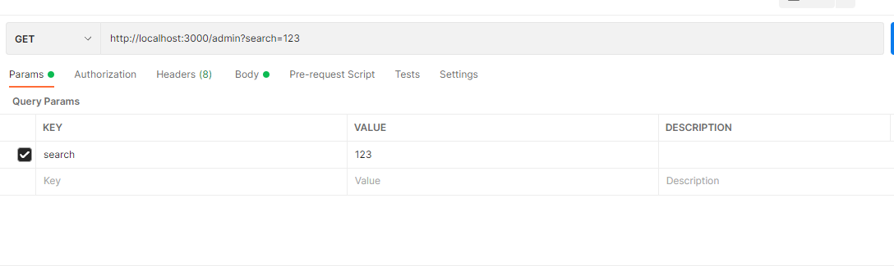
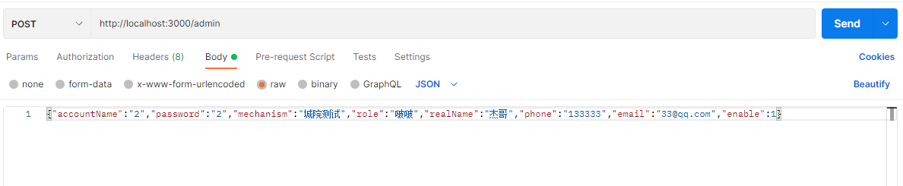
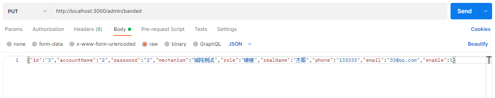
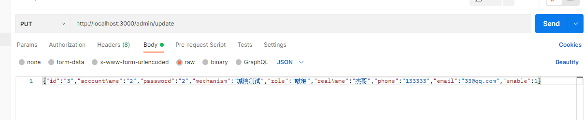
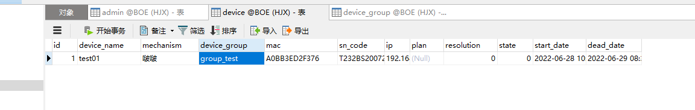
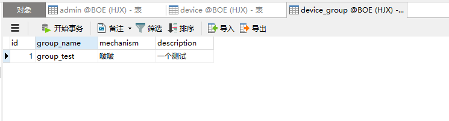
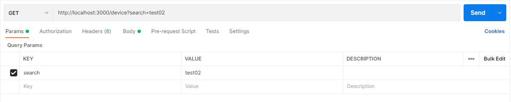
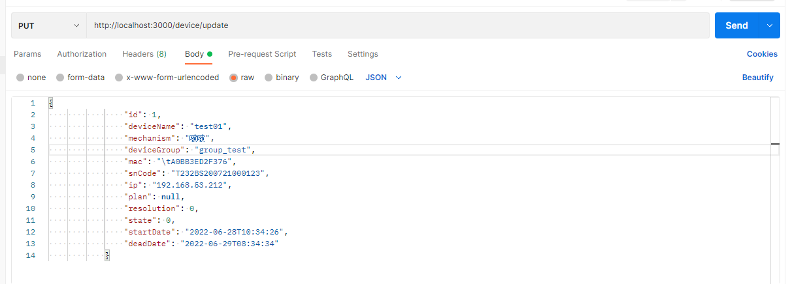
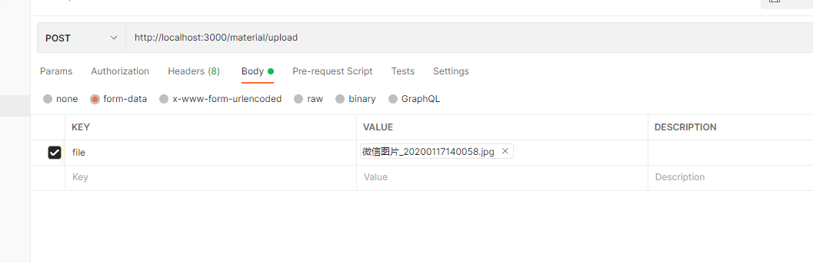
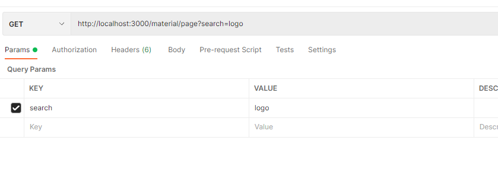

**管理员 admin**

http://localhost:3000

1. 搜索

   /admin

   **get**请求 **Params**传参   对**账户名**模糊查询

   参数名 search

2.添加

​	/admin

​	**post**请求 **body**传参

​	

​    **enable(int) 是否禁用  1启用/0禁用**

3.登录

​	/admin/login

​	**post**请求 **body**传参

​	accountName(string)

​	password(string)

4.禁用 or 启用（待修改）

​	/admin/banded

​	**put**请求 **body**传参

​	

​	

​	传入整个admin类，即 **所有用户信息（一定要有id）**

5.修改

​	/admin/update

各个值请**不要为null**

**设备 device**

http://localhost:3000/device

设备表：

- **resolution (int) 分辨率 0/1 为竖屏或横屏**
- **state（int)   状态 离线/在线**

设备分组 表：

1.获取

get 请求 http://localhost:3000/device

1.查询（对**设备名**查询）

​	**get**  请求   **params** 传参

关键词 ： **search**

2.修改

**/update**

**put** 请求  **body**传参

请传入**整个**device

**素材 material**

1.上传

接口：/material/upload

**post**请求  **form-data**形式传文件

2.通过url查看

接口：**/imgs/{url}**

例子 ：**localhost:3000/imgs/f0724121b22e442dae4d84771f52069f.jpg**

3.下载

接口： **/material/{url}**

例子： **localhost:3000/material/f0724121b22e442dae4d84771f52069f.jpg**

4.查询

接口：/material/page

**get**  请求   **params** 传参

关键词 ： **search**

5.修改

接口： /material/update

put请求

***千万不要修改url***